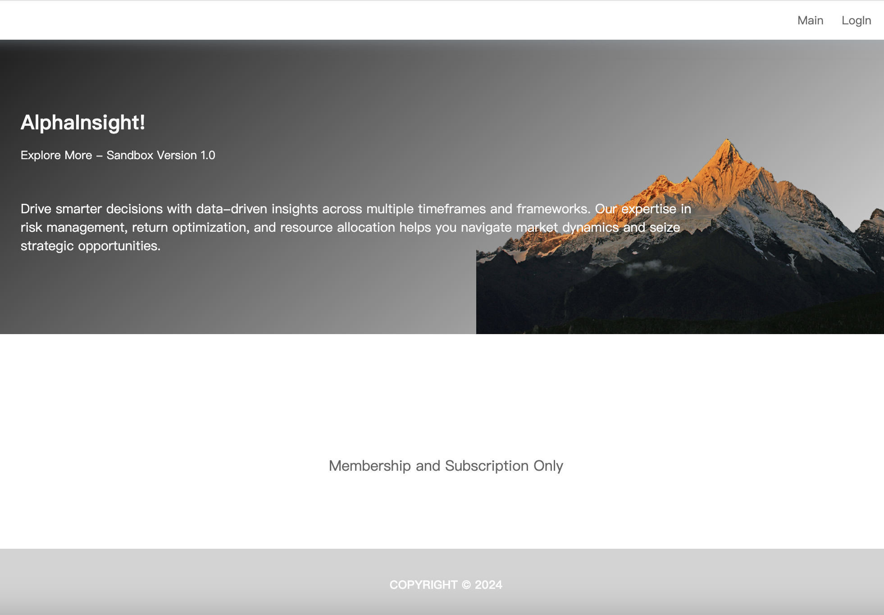

<div id="top">


# ALPHAINSIGHT

<em></em>

<!-- BADGES -->


<!-- default option, no dependency badges. -->


<!-- default option, no dependency badges. -->

</div>
<br>

---

## Table of Contents

- [Table of Contents](#table-of-contents)
- [Overview](#overview)
- [Features](#features)
- [Project Structure](#project-structure)
    - [Project Index](#project-index)
- [Getting Started](#getting-started)
    - [Prerequisites](#prerequisites)
    - [Installation](#installation)
    - [Usage](#usage)
    - [Testing](#testing)
- [Roadmap](#roadmap)
- [Contributing](#contributing)
- [License](#license)
- [Acknowledgments](#acknowledgments)

---

## Overview

ALPHAINSIGHT is a lightweight strategy monitoring platform with the following key features:

📊 Strategy Performance – Calculates strategy returns to evaluate profitability.

⚖️ Risk Assessment – Measures risk parameters such as drawdowns and exposure.

📈 Volatility Tracking – Monitors fluctuations to capture market dynamics.

🔍 Parameter Monitoring – Continuously tracks key metrics for real-time insights.

🔐 Secure Access – Includes a member authentication system for identity verification.

⚡ Lightweight Evaluation – Provides a streamlined environment for strategy analysis and monitoring.

---

## Project Structure

```sh
└── Alphainsight/
    ├── README.md
    ├── api
    │   ├── .DS_Store
    │   ├── nav_api.py
    │   └── user_api.py
    ├── app.py
    ├── database.py
    ├── redis_clients.py
    ├── sqlite.db
    ├── static
    │   ├── .DS_Store
    │   ├── css
    │   ├── js
    │   └── pic
    ├── templates
    │   ├── .DS_Store
    │   ├── basic.html
    │   └── index.html
    └── update_pseudo_data
        ├── default_sqlite.py
        ├── sqlite_update_nav.py
        └── sqlite_update_spy.py
```

### Project Index

<details open>
	<summary><b><code>ALPHAINSIGHT/</code></b></summary>
	<!-- __root__ Submodule -->
	<details>
		<summary><b>__root__</b></summary>
		<blockquote>
			<div class='directory-path' style='padding: 8px 0; color: #666;'>
				<code><b>⦿ __root__</b></code>
			<table style='width: 100%; border-collapse: collapse;'>
			<thead>
				<tr style='background-color: #f8f9fa;'>
					<th style='width: 30%; text-align: left; padding: 8px;'>File Name</th>
					<th style='text-align: left; padding: 8px;'>Summary</th>
				</tr>
			</thead>
				<tr style='border-bottom: 1px solid #eee;'>
					<td style='padding: 8px;'><b><a href='https://github.com/lukerspace/Alphainsight/blob/master/database.py'>database.py</a></b></td>
					<td style='padding: 8px;'>Code>❯ REPLACE-ME</code></td>
				</tr>
				<tr style='border-bottom: 1px solid #eee;'>
					<td style='padding: 8px;'><b><a href='https://github.com/lukerspace/Alphainsight/blob/master/redis_clients.py'>redis_clients.py</a></b></td>
					<td style='padding: 8px;'>Code>❯ REPLACE-ME</code></td>
				</tr>
				<tr style='border-bottom: 1px solid #eee;'>
					<td style='padding: 8px;'><b><a href='https://github.com/lukerspace/Alphainsight/blob/master/app.py'>app.py</a></b></td>
					<td style='padding: 8px;'>Code>❯ REPLACE-ME</code></td>
				</tr>
			</table>
		</blockquote>
	</details>
	<!-- update_pseudo_data Submodule -->
	<details>
		<summary><b>update_pseudo_data</b></summary>
		<blockquote>
			<div class='directory-path' style='padding: 8px 0; color: #666;'>
				<code><b>⦿ update_pseudo_data</b></code>
			<table style='width: 100%; border-collapse: collapse;'>
			<thead>
				<tr style='background-color: #f8f9fa;'>
					<th style='width: 30%; text-align: left; padding: 8px;'>File Name</th>
					<th style='text-align: left; padding: 8px;'>Summary</th>
				</tr>
			</thead>
				<tr style='border-bottom: 1px solid #eee;'>
					<td style='padding: 8px;'><b><a href='https://github.com/lukerspace/Alphainsight/blob/master/update_pseudo_data/sqlite_update_spy.py'>sqlite_update_spy.py</a></b></td>
					<td style='padding: 8px;'>Code>❯ REPLACE-ME</code></td>
				</tr>
				<tr style='border-bottom: 1px solid #eee;'>
					<td style='padding: 8px;'><b><a href='https://github.com/lukerspace/Alphainsight/blob/master/update_pseudo_data/default_sqlite.py'>default_sqlite.py</a></b></td>
					<td style='padding: 8px;'>Code>❯ REPLACE-ME</code></td>
				</tr>
				<tr style='border-bottom: 1px solid #eee;'>
					<td style='padding: 8px;'><b><a href='https://github.com/lukerspace/Alphainsight/blob/master/update_pseudo_data/sqlite_update_nav.py'>sqlite_update_nav.py</a></b></td>
					<td style='padding: 8px;'>Code>❯ REPLACE-ME</code></td>
				</tr>
			</table>
		</blockquote>
	</details>
	<!-- api Submodule -->
	<details>
		<summary><b>api</b></summary>
		<blockquote>
			<div class='directory-path' style='padding: 8px 0; color: #666;'>
				<code><b>⦿ api</b></code>
			<table style='width: 100%; border-collapse: collapse;'>
			<thead>
				<tr style='background-color: #f8f9fa;'>
					<th style='width: 30%; text-align: left; padding: 8px;'>File Name</th>
					<th style='text-align: left; padding: 8px;'>Summary</th>
				</tr>
			</thead>
				<tr style='border-bottom: 1px solid #eee;'>
					<td style='padding: 8px;'><b><a href='https://github.com/lukerspace/Alphainsight/blob/master/api/user_api.py'>user_api.py</a></b></td>
					<td style='padding: 8px;'>Code>❯ REPLACE-ME</code></td>
				</tr>
				<tr style='border-bottom: 1px solid #eee;'>
					<td style='padding: 8px;'><b><a href='https://github.com/lukerspace/Alphainsight/blob/master/api/nav_api.py'>nav_api.py</a></b></td>
					<td style='padding: 8px;'>Code>❯ REPLACE-ME</code></td>
				</tr>
			</table>
		</blockquote>
	</details>
	<!-- templates Submodule -->
	<details>
		<summary><b>templates</b></summary>
		<blockquote>
			<div class='directory-path' style='padding: 8px 0; color: #666;'>
				<code><b>⦿ templates</b></code>
			<table style='width: 100%; border-collapse: collapse;'>
			<thead>
				<tr style='background-color: #f8f9fa;'>
					<th style='width: 30%; text-align: left; padding: 8px;'>File Name</th>
					<th style='text-align: left; padding: 8px;'>Summary</th>
				</tr>
			</thead>
				<tr style='border-bottom: 1px solid #eee;'>
					<td style='padding: 8px;'><b><a href='https://github.com/lukerspace/Alphainsight/blob/master/templates/basic.html'>basic.html</a></b></td>
					<td style='padding: 8px;'>Code>❯ REPLACE-ME</code></td>
				</tr>
				<tr style='border-bottom: 1px solid #eee;'>
					<td style='padding: 8px;'><b><a href='https://github.com/lukerspace/Alphainsight/blob/master/templates/index.html'>index.html</a></b></td>
					<td style='padding: 8px;'>Code>❯ REPLACE-ME</code></td>
				</tr>
			</table>
		</blockquote>
	</details>
</details>

---

## Getting Started

### Prerequisites

This project requires the following dependencies:

- **Programming Language:** Python

### Installation

Build Alphainsight from the source and intsall dependencies:

1. **Clone the repository:**

    ```sh
    ❯ git clone https://github.com/lukerspace/Alphainsight
    ```

2. **Navigate to the project directory:**

    ```sh
    ❯ cd Alphainsight
    ```

3. **Install the dependencies:**

   pip install -r 'requirement.txt'

### Usage

Run the project with:

python run app.py


When the server starts, the application will automatically trigger the init_schema function from update_pseudo_data, which:

Creates the SQLite database schema

Populates the database with initial sample data

Since the project is designed for lightweight usage, it does not rely on an external database but instead uses SQLite for easy deployment.

After deployment:

Create a new user account through the web interface.

Interact with the platform directly.

You will be able to view the default strategy (NVDA Buy & Hold) alongside the benchmark SPY, including recent performance comparisons and backtesting results.





